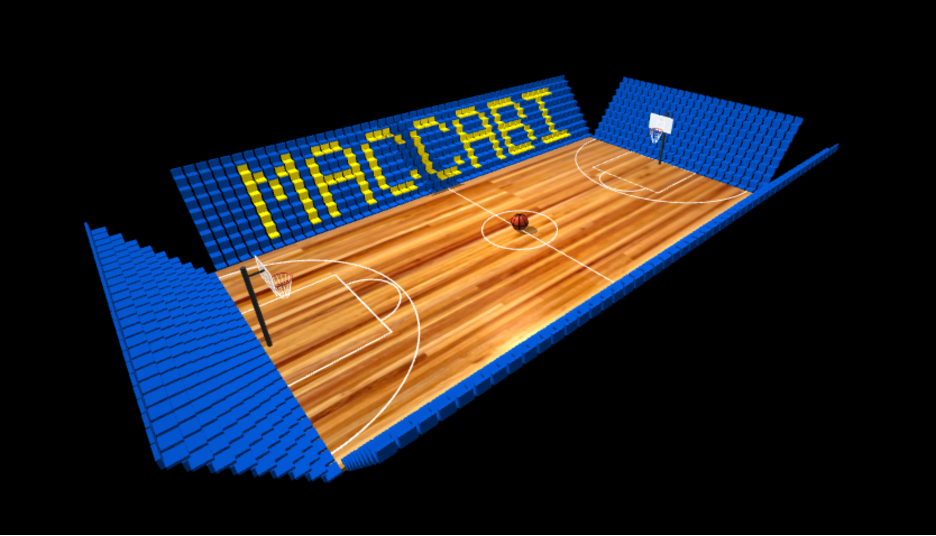
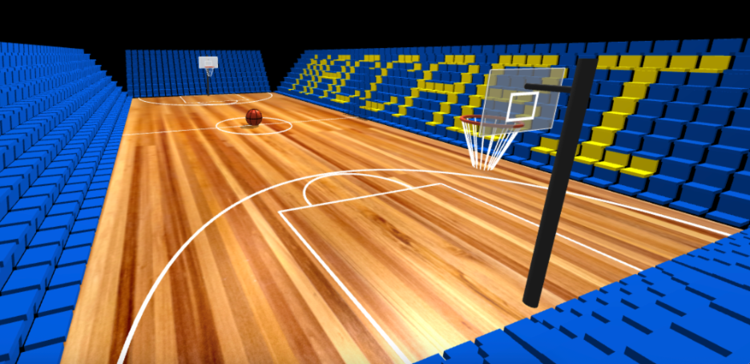
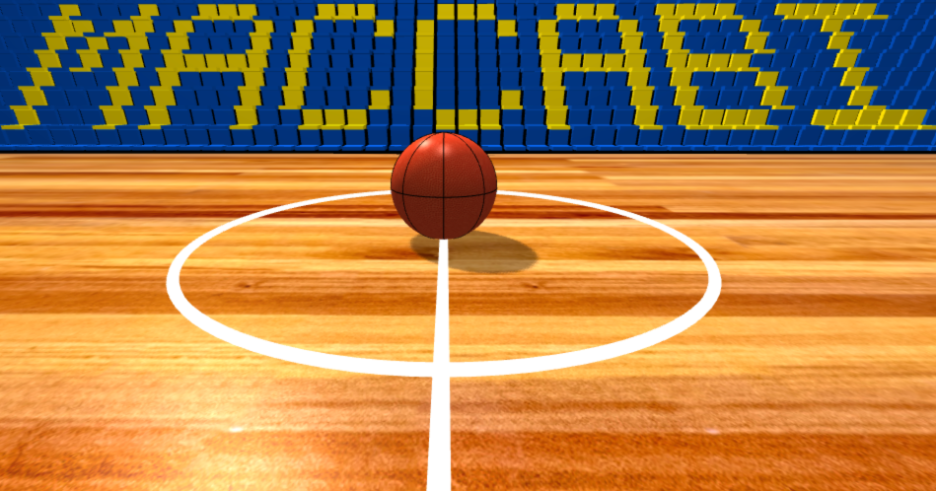
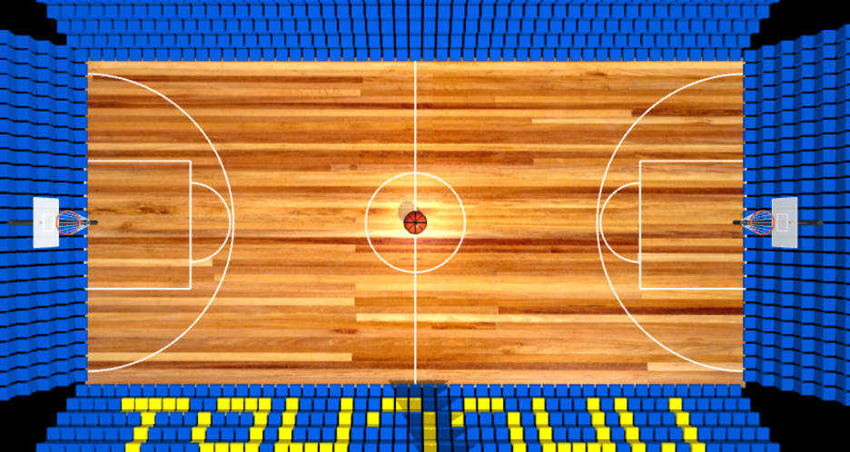
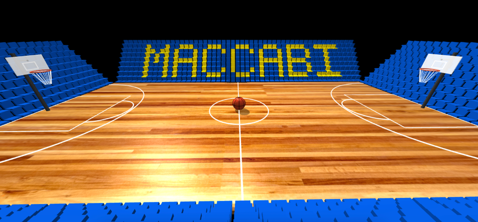
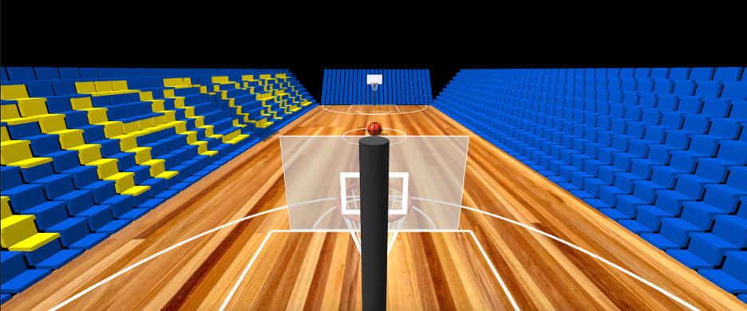

# Computer Graphics - Exercise 5 - WebGL Basketball Court

## Getting Started
1. Clone this repository to your local machine
2. Make sure you have Node.js installed
3. Run npm install
4. Start the local web server: `node index.js`
5. Open your browser and go to http://localhost:8000

## Complete Instructions
**All detailed instructions, requirements, and specifications can be found in:**
`basketball_exercise_instructions.html`

## Group Members
**MANDATORY: Add the full names of all group members here:**
- Noam shildekraut
- Ilay Ram

## Technical Details
- Run the server with: `node index.js`
- Access at http://localhost:8000 in your web browser

## Additional Features
- Free-throw lines, three-point lines, center circle.
- Semi-transparent shooter’s square etched into each backboard
- High-resolution wood texture on the court and realistic orange/black seam texture on the basketball
- Hoop rims built from torus (tube) geometry instead of simple line segments
- Score Board
- Stadium environment with bleachers on all sides
- Multiple camera preset positions for fast switching:
  - **Z** – Aerial view
  - **X** – VIP seating team 1 
  - **C** – VIP seating team 2
  - **V** – Behind the basket team 1 view
  - **B** – Behind the basket team 2 view

## Screenshots

